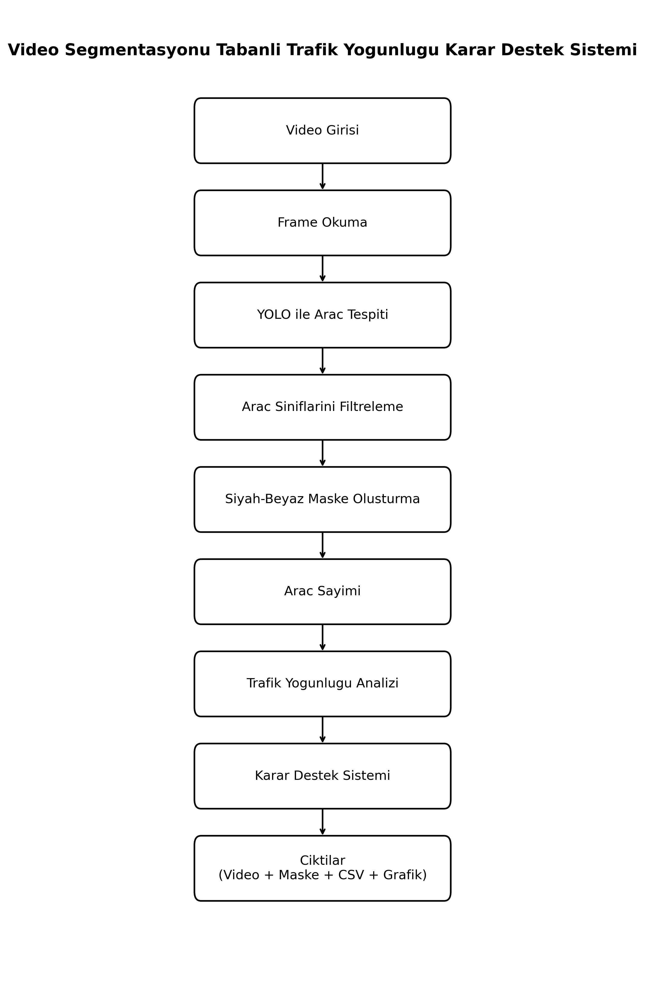

# Video Segmentasyonu Tabanlı Trafik Yoğunluğu Karar Destek Sistemi

## Öğrenci Bilgileri

| Bilgi            | Açıklama     |
| ---------------- | ------------ |
| Ad Soyad         | Emine Kenan  |
| Öğrenci Numarası | 2404040243   |
| Ders             | Lineer Cebir |

---

## Proje Açıklaması

Bu proje, trafik videosu üzerinde araç tespiti, siyah-beyaz segmentasyon maskesi oluşturma ve trafik yoğunluğu karar destek sistemi geliştirme amacıyla hazırlanmıştır.

Proje kapsamında sabit kamera ile elde edilen trafik görüntüsü karelere ayrılmış, YOLOv8 modeli kullanılarak araçlar tespit edilmiş ve tespit edilen araç bölgeleri ikili maske yapısında gösterilmiştir. Ardından her karedeki araç sayısı kullanılarak trafik yoğunluğu düşük, orta veya yüksek olarak sınıflandırılmıştır.

---

## Projenin Amacı

Bu çalışmanın amacı, trafik videosundaki araçları otomatik olarak tespit etmek, araç bölgelerini segmentasyon maskesi ile görselleştirmek ve elde edilen araç sayısına göre trafik yoğunluğu hakkında karar üretmektir.

Bu sistem, trafik izleme, yoğunluk analizi ve karar destek sistemleri için temel bir mühendislik çözümü sunmaktadır.

---

## Problem Tanımı

Trafik yoğunluğunun manuel olarak izlenmesi zaman alıcı ve hataya açık bir süreçtir. Özellikle kavşak, ana yol veya şehir içi trafik kameralarından elde edilen videolarda araç sayısının otomatik olarak belirlenmesi trafik yönetimi açısından önemlidir.

Bu projede, trafik videosu üzerinde araçların tespit edilmesi ve araç sayısına göre trafik yoğunluğu kararının otomatik olarak verilmesi hedeflenmiştir.

---

## Kullanılan Teknolojiler

Projede kullanılan temel teknolojiler şunlardır:

* Python
* OpenCV
* YOLOv8
* Ultralytics
* NumPy
* Pandas
* Matplotlib

---

## Kullanılan Veri

Projede kullanılan trafik videosu Kaggle üzerinden alınmıştır.

Kaggle veri seti bağlantısı:

https://www.kaggle.com/datasets/abirsaha2307/video-for-traffic-anomaly-detection

Google Drive yedek video bağlantısı:

https://drive.google.com/file/d/1850itDRPyYAol_Ur-LxQFhNSYGYXRL3U/view?usp=sharing

Video dosyası GitHub tek dosya boyut sınırını aştığı için repoya eklenmemiştir. Projeyi çalıştırmak için Kaggle bağlantısından veya Google Drive yedek bağlantısından video dosyası indirilmeli ve proje klasöründe aşağıdaki konuma yerleştirilmelidir:

```text
data/traffic_video.mp4

---

## Proje Dosya Yapısı

Proje klasör yapısı aşağıdaki gibidir:

```text
video_segmentasyon_odevi/
│
├── data/
│   └── traffic_video.mp4
│       Not: Bu video dosyası büyük boyutlu olduğu için GitHub'a yüklenmemiştir.
│            Kaggle veri bağlantısından indirilerek bu klasöre eklenmelidir.
│
├── outputs/
│   ├── arac_tespit_sonucu.avi
│   ├── segmentasyon_maskesi.avi
│   ├── analiz_sonuclari.csv
│   └── analysis_summary.txt
│
├── report_images/
│   ├── arac_yogunluk_grafigi.png
│   ├── system_flow_diagram.png
│   ├── low_density_detection.png
│   ├── low_density_mask.png
│   ├── medium_density_detection.png
│   ├── medium_density_mask.png
│   ├── high_density_detection.png
│   └── high_density_mask.png
│
├── main.py
├── create_flow_diagram.py
├── requirements.txt
├── .gitignore
└── README.md
```

---

## Yöntem

Bu projede nesne tespiti tabanlı video segmentasyonu yaklaşımı kullanılmıştır.

İlk olarak video OpenCV kütüphanesi ile okunmuştur. Daha sonra her kare YOLOv8 modeline verilerek araç sınıfları tespit edilmiştir. Tespit edilen araçların sınırlayıcı kutu koordinatları alınmış ve bu koordinatlar kullanılarak siyah-beyaz segmentasyon maskesi oluşturulmuştur.

Maskede:

```text
Beyaz alanlar : Araç bölgeleri
Siyah alanlar : Arka plan
```

olarak temsil edilmiştir.

---

## YOLO ile Araç Tespiti

Projede YOLOv8 modeli kullanılmıştır. YOLO, görüntü üzerindeki nesneleri hızlı bir şekilde tespit edebilen derin öğrenme tabanlı bir nesne tespit algoritmasıdır.

Bu projede yalnızca trafik yoğunluğu ile ilişkili sınıflar dikkate alınmıştır.

Kullanılan araç sınıfları:

```text
car
motorcycle
bus
truck
```

YOLO modelinden gelen diğer sınıflar filtrelenmiştir.

---

## Segmentasyon Maskesi

Araç tespiti sonucunda elde edilen sınırlayıcı kutular kullanılarak ikili segmentasyon maskesi oluşturulmuştur.

Bu maske, görüntüdeki araç bölgelerini daha belirgin şekilde göstermek amacıyla kullanılmıştır.

Segmentasyon maskesinde araçların bulunduğu bölgeler beyaz, arka plan ise siyah olarak gösterilmiştir.

Bu sayede sistemin hangi bölgeleri araç olarak algıladığı görsel olarak analiz edilebilmektedir.

---

## Karar Destek Sistemi

Araç sayısı kullanılarak trafik yoğunluğu hakkında karar üreten basit bir karar destek sistemi tasarlanmıştır.

Karar kuralları aşağıdaki gibidir:

```text
0 - 5 araç    : Düşük Yoğunluk
6 - 12 araç   : Orta Yoğunluk
13 ve üzeri   : Yüksek Yoğunluk
```

Bu kurallar her kare için uygulanmış ve sonuçlar CSV dosyasına kaydedilmiştir.

---

## Sistem Akışı

Sistemin genel çalışma adımları aşağıdaki gibidir:

```text
1. Video sisteme yüklenir.
2. Video karelere ayrılır.
3. YOLOv8 modeli ile araçlar tespit edilir.
4. Araç sınıfları filtrelenir.
5. Araç bölgeleri için siyah-beyaz maske oluşturulur.
6. Her karedeki araç sayısı hesaplanır.
7. Araç sayısına göre yoğunluk kararı verilir.
8. Sonuç videosu, maske videosu, CSV dosyası ve grafik oluşturulur.
```

---

## Sistem Akış Diyagramı

Aşağıda geliştirilen sistemin genel işlem adımları gösterilmiştir.



---

## Program Çıktıları

Program çalıştırıldığında aşağıdaki çıktılar oluşturulur:

```text
outputs/arac_tespit_sonucu.avi
outputs/segmentasyon_maskesi.avi
outputs/analiz_sonuclari.csv
outputs/analysis_summary.txt
report_images/arac_yogunluk_grafigi.png
```

Ayrıca karşılaştırmalı görsel analiz için düşük, orta ve yüksek yoğunluk durumlarına ait örnek tespit ve maske görselleri `report_images` klasörüne kaydedilir.

---

## Araç Tespit Videosu

`arac_tespit_sonucu.avi` dosyasında video üzerinde tespit edilen araçlar yeşil kutular ile gösterilir.

Ayrıca ekranda:

```text
Frame numarası
Toplam araç sayısı
Trafik yoğunluğu kararı
```

bilgileri yer alır.

---

## Segmentasyon Maskesi Videosu

`segmentasyon_maskesi.avi` dosyasında araç bölgeleri siyah-beyaz maske ile gösterilir.

Bu çıktı, segmentasyon sonucunun görsel olarak incelenmesini sağlar.

---

## CSV Analiz Dosyası

`analiz_sonuclari.csv` dosyasında her kare için aşağıdaki bilgiler tutulur:

```text
Frame
Vehicle_Count
Density_Decision
```

Bu dosya, deneysel analiz ve performans değerlendirme için kullanılmıştır.

---

## Analiz Özeti Dosyası

`analysis_summary.txt` dosyasında video bilgileri, ortalama araç sayısı, maksimum araç sayısı, minimum araç sayısı, yoğunluk karar dağılımı ve oluşturulan çıktı dosyalarının bilgileri yer almaktadır.

Bu dosya, makale yazımında bulgular ve performans değerlendirme kısmı için kullanılabilir.

---

## Grafik Çıktısı

`arac_yogunluk_grafigi.png` dosyası, frame bazlı araç sayısı değişimini göstermektedir.

Bu grafik sayesinde video boyunca trafik yoğunluğundaki değişim görsel olarak analiz edilebilir.

---

## Kurulum

Projeyi çalıştırmak için önce gerekli Python kütüphaneleri yüklenmelidir.

Terminalde proje klasörü içindeyken aşağıdaki komut çalıştırılır:

```bash
pip install -r requirements.txt
```

---

## requirements.txt İçeriği

Projede kullanılan paketler aşağıdaki gibidir:

```text
opencv-python
numpy
pandas
matplotlib
ultralytics
```

---

## Çalıştırma Öncesi Veri Dosyası Hazırlığı

Projeyi çalıştırmadan önce Kaggle bağlantısından trafik videosu indirilmelidir:

```text
https://www.kaggle.com/datasets/abirsaha2307/video-for-traffic-anomaly-detection
```

İndirilen video dosyası proje klasöründe aşağıdaki konuma yerleştirilmelidir:

```text
data/traffic_video.mp4
```

Dosya adı farklıysa `traffic_video.mp4` olarak yeniden adlandırılmalıdır.

---

## Çalıştırma

Programı çalıştırmak için terminalde aşağıdaki komut kullanılır:

```bash
python main.py
```

Not: `yolov8n.pt` model dosyası GitHub'a yüklenmemiştir. Program ilk çalıştırmada bu modeli Ultralytics üzerinden otomatik indirir. İnternet bağlantısı olmayan ortamlarda `yolov8n.pt` dosyası proje ana dizinine manuel olarak eklenmelidir.

İlk çalıştırmada YOLO model dosyası otomatik olarak indirilebileceği için işlem biraz daha uzun sürebilir.

---

## Performans Değerlendirme

Bu projede performans değerlendirmesi, araç sayısı ve trafik yoğunluğu kararları üzerinden yapılmıştır.

Kullanılan değerlendirme çıktıları:

```text
Ortalama araç sayısı
Maksimum araç sayısı
Minimum araç sayısı
Yoğunluk karar dağılımı
Frame bazlı araç sayısı grafiği
```

Bu değerler program çalıştıktan sonra konsolda gösterilir. Ayrıca sonuçlar `analysis_summary.txt`, `analiz_sonuclari.csv` ve `arac_yogunluk_grafigi.png` dosyaları ile kayıt altına alınır.

---

## Projenin Katkısı

Bu proje, video segmentasyonu ve karar destek sistemi bileşenlerini bir arada kullanan uygulamalı bir mühendislik çalışmasıdır.

Sistem, trafik videosu üzerinden araçları tespit etmekte, araç bölgelerini maske ile göstermekte ve yoğunluk kararını otomatik olarak üretmektedir.

Bu yönüyle çalışma, akıllı trafik sistemleri ve görüntü işleme tabanlı karar destek uygulamaları için temel bir örnek oluşturmaktadır.

---

## Notlar

Bu çalışmada kullanılan siyah-beyaz segmentasyon maskesi, YOLO modelinden elde edilen sınırlayıcı kutular kullanılarak oluşturulmuştur.

Bu nedenle maske, araç bölgelerini dikdörtgen alanlar şeklinde göstermektedir.

Duran araçların da sayılabilmesi için yalnızca hareket tabanlı arka plan çıkarma yöntemi yerine nesne tespiti tabanlı YOLO yaklaşımı tercih edilmiştir.

Video dosyası büyük boyutlu olduğu için GitHub reposuna eklenmemiştir. Veri seti bağlantısı README dosyasında belirtilmiştir.

---

## Geliştirilebilir Yönler

Bu proje ileride aşağıdaki yönlerden geliştirilebilir:

* Daha büyük YOLO modeli kullanılarak tespit başarımı artırılabilir.
* Şerit bazlı yoğunluk analizi yapılabilir.
* Gerçek zamanlı kamera görüntüsü ile çalışacak hale getirilebilir.
* Araç takibi eklenerek aynı aracın farklı karelerde tekrar değerlendirilmesi daha kontrollü hale getirilebilir.

---

## Sonuç

Bu projede trafik videosu üzerinde araç tespiti, segmentasyon maskesi oluşturma ve trafik yoğunluğu karar destek sistemi geliştirilmiştir.

Elde edilen sonuçlar, video segmentasyonu ve karar destek sistemi bileşenlerinin birlikte kullanılabileceğini göstermektedir. Sistem, araç sayısına dayalı olarak trafik yoğunluğunu düşük, orta ve yüksek olmak üzere üç sınıfta değerlendirmiştir.
